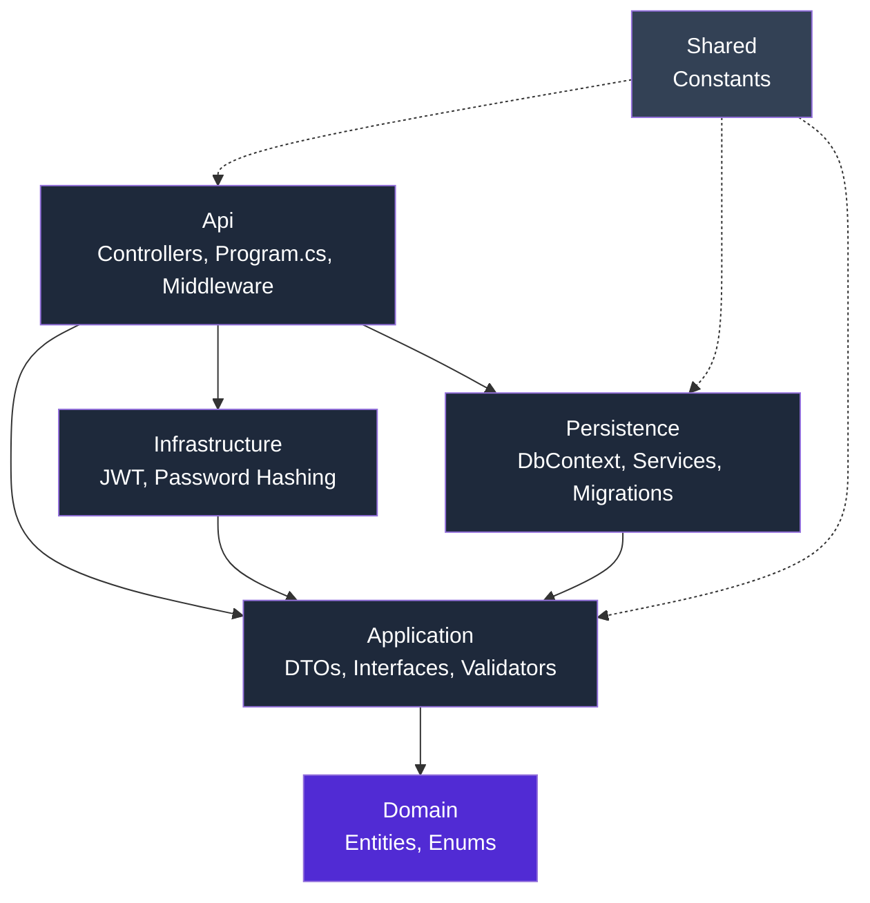
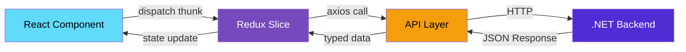
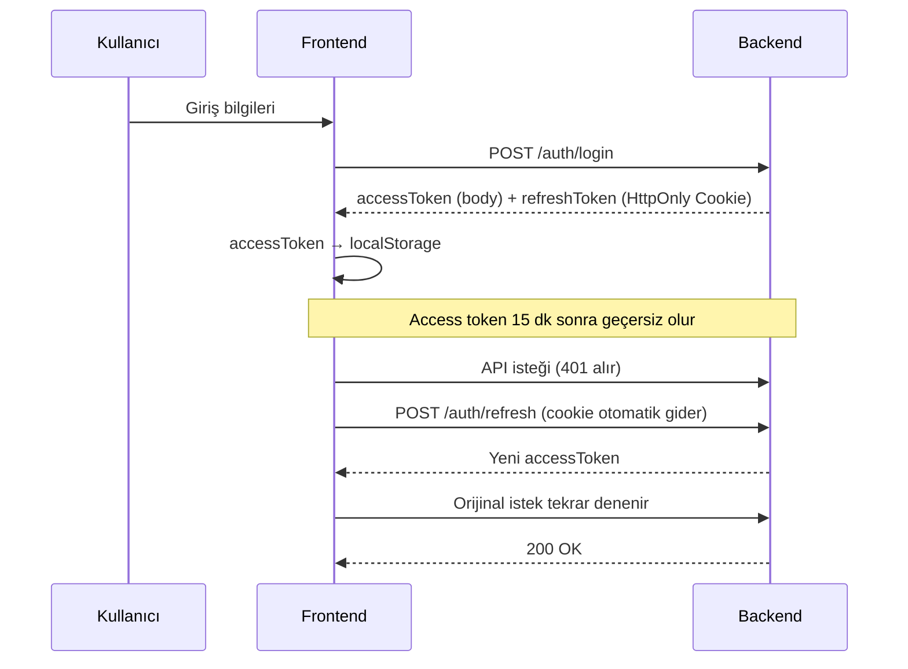

# WorkSphere — HR & Task Management System

<p align="center">
  
  
  
  
  
</p>

<p align="center">
  Şirket içi İnsan Kaynakları ve Görev Yönetimi için geliştirilmiş, <b>Clean Architecture</b> prensipleriyle kurulmuş<br/>
  full-stack bir web uygulaması.
</p>

---

## 📋 İçindekiler

- [Genel Bakış](#-genel-bakış)
- [Teknoloji Yığını](#-teknoloji-yığını)
- [Mimari](#-mimari)
- [Özellikler](#-özellikler)
- [Ekran Görüntüleri](#-ekran-görüntüleri)
- [Kurulum](#-kurulum)
- [Proje Yapısı](#-proje-yapısı)
- [API Uç Noktaları](#-api-uç-noktaları)
- [Kimlik Doğrulama & Güvenlik](#-kimlik-doğrulama--güvenlik)
- [Ortam Değişkenleri](#-ortam-değişkenleri)
- [Bilinen Sınırlamalar & Yol Haritası](#-bilinen-sınırlamalar--yol-haritası)

---

## 🎯 Genel Bakış

**WorkSphere**, bir şirketin İK süreçlerini (çalışan yönetimi, departman/pozisyon organizasyonu, izin talepleri) ve operasyonel süreçlerini (görev takibi, demirbaş zimmet yönetimi, bildirimler) tek bir platformda birleştiren bir sistemdir.

Proje, backend'de **.NET 9 / ASP.NET Core Web API** ile **Clean Architecture**, frontend'de **React 19 + TypeScript + Redux Toolkit** ile geliştirilmiştir.

| | |
|---|---|
| **Backend** | ASP.NET Core Web API (.NET 9), Entity Framework Core (Code-First) |
| **Frontend** | React 19, TypeScript, Redux Toolkit, React Router, Tailwind CSS v4 |
| **Veritabanı** | Microsoft SQL Server |
| **Kimlik Doğrulama** | JWT (Access Token) + HttpOnly Cookie (Refresh Token, Rotation + Reuse Detection) |
| **Mimari** | Clean Architecture (Backend) · Feature-based Redux Slices (Frontend) |

---

## 🛠 Teknoloji Yığını

### Backend

| Katman / Araç | Teknoloji |
|---|---|
| Framework | ASP.NET Core 9 Web API |
| ORM | Entity Framework Core (Code-First, Fluent API) |
| Veritabanı | SQL Server |
| Kimlik Doğrulama | JWT Bearer + HttpOnly Cookie (Refresh Token) |
| Şifreleme | BCrypt (workFactor: 12) |
| Validasyon | FluentValidation |
| Mimari | Clean Architecture (Domain / Application / Infrastructure / Persistence / Api / Shared) |

### Frontend

| Katman / Araç | Teknoloji |
|---|---|
| Framework | React 19 + TypeScript |
| Build Tool | Vite |
| State Management | Redux Toolkit (`createSlice`, `createAsyncThunk`) |
| Routing | React Router v7 |
| Stil | Tailwind CSS v4 |
| HTTP Client | Axios (request/response interceptor'lar ile) |
| İkonlar | Lucide React |
| Linter | ESLint |

---

## 🏗 Mimari

### Backend — Clean Architecture Katman Yapısı



**Kural:** Bağımlılıklar her zaman içe doğru akar. `Domain` katmanı hiçbir framework'e bağımlı değildir — sadece saf C# entity'leri ve enum'lar içerir.

| Katman | Sorumluluk |
|---|---|
| **Domain** | Entity'ler (`User`, `Employee`, `TaskItem`, `Asset`...), enum'lar |
| **Application** | DTO'lar, servis sözleşmeleri (interface), FluentValidation kuralları |
| **Infrastructure** | JWT üretimi, şifre hashleme gibi teknik implementasyonlar |
| **Persistence** | `DbContext`, EF Core konfigürasyonları, servis implementasyonları, migration'lar |
| **Api** | Controller'lar, middleware, `Program.cs` (Composition Root) |
| **Shared** | Katman sınırı tanımayan sabitler (`SystemRoles` vb.) |

### Frontend — Veri Akış Mimarisi



Her domain (Employee, Task, Department...) için tekrar eden bir dosya şablonu izlenir:

```
types/<domain>.ts        → TypeScript arayüzleri (backend DTO karşılıkları)
api/<domain>Api.ts        → Axios tabanlı HTTP çağrıları
store/slices/<domain>Slice.ts → Redux state + createAsyncThunk
pages/<Domain>List.tsx    → Liste sayfası
components/features/      → Domain'e özel modal/form bileşenleri
```

---

## ✨ Özellikler

| Modül | Açıklama |
|---|---|
| 🔐 **Kimlik Doğrulama** | JWT tabanlı login/register, rotation + reuse detection'lı refresh token, HttpOnly cookie ile XSS koruması |
| 👥 **Çalışan Yönetimi** | CRUD, arama/filtreleme/sayfalama, soft delete |
| 🏢 **Departman & Pozisyon** | Organizasyon yapısı yönetimi, yönetici ataması |
| ✅ **Görev Takibi** | Durum bazlı (Beklemede / Devam Ediyor / Tamamlandı / İptal) renkli rozetlerle görev listesi, URL senkronize filtreleme |
| 📦 **Demirbaş Yönetimi** | Zimmetleme / iade akışı, sadece "Müsait" durumundaki demirbaşların zimmetlenebilmesi |
| 🌴 **İzin Talepleri** | Çalışanların kendi izin taleplerini oluşturması, yönetici onay/red akışı |
| 🔔 **Bildirimler** | Görev atandığında veya izin onaylandığında otomatik bildirim, okunmamışları listeleyen dropdown |
| 🛡️ **Rol Bazlı Yetkilendirme** | Policy-based authorization (`RequireAdmin`, `RequireManagerOrAbove`, `AdminOrHR`), frontend'de `ProtectedRoute` |

---

## 📸 Ekran Görüntüleri

> Aşağıdaki alanlara ilgili ekran görüntülerini ekleyebilirsiniz.

<table>
  <tr>
    <td align="center"><b>Giriş Ekranı</b><br/></td>
    <td align="center"><b>Dashboard</b><br/></td>
  </tr>
  <tr>
    <td align="center"><b>Çalışan Listesi</b><br/></td>
    <td align="center"><b>Görev Yönetimi</b><br/></td>
  </tr>
</table>

---

## 🚀 Kurulum

### Ön Gereksinimler

| Araç | Sürüm |
|---|---|
| .NET SDK | 9.0+ |
| Node.js | 18+ |
| SQL Server | LocalDB veya tam sürüm |

### Backend Kurulumu

```bash
# Repoyu klonlayın
git clone https://github.com/BlazeShaper/HRTaskManagement.git
cd HRTaskManagement

# appsettings.json içindeki connection string'i kendi SQL Server adresinize göre düzenleyin

# Migration'ları uygulayın
dotnet ef database update --project HRTaskManagement.Persistence --startup-project HRTaskManagement.Api

# API'yi çalıştırın
dotnet run --project HRTaskManagement.Api
```

Backend varsayılan olarak `http://localhost:5048` (veya `launchSettings.json`'da belirtilen port) üzerinde çalışır.

### Frontend Kurulumu

```bash
cd worksphere-ui

# Bağımlılıkları kurun
npm install

# .env dosyası oluşturun
echo "VITE_API_BASE_URL=http://localhost:5048/api" > .env

# Geliştirme sunucusunu başlatın
npm run dev
```

Frontend varsayılan olarak `http://localhost:5173` üzerinde çalışır.

### Production Build

```bash
# Backend
dotnet build -c Release

# Frontend
cd worksphere-ui
npm run build   # dist/ klasörüne derlenir
npm run preview # build'i yerel olarak test etmek için
```

---

## 📁 Proje Yapısı

<table>
<tr>
<td valign="top" width="50%">

**Backend**

```
HRTaskManagement/
├── HRTaskManagement.Domain/
│   ├── Entities/
│   ├── Enums/
│   └── Common/
├── HRTaskManagement.Application/
│   ├── DTOs/
│   ├── Interfaces/
│   └── Validators/
├── HRTaskManagement.Infrastructure/
│   └── Services/
├── HRTaskManagement.Persistence/
│   ├── Context/
│   ├── Configurations/
│   ├── Migrations/
│   ├── Seed/
│   └── Services/
├── HRTaskManagement.Api/
│   ├── Controllers/
│   ├── Middleware/
│   ├── Filters/
│   └── Program.cs
└── HRTaskManagement.Shared/
    └── Constants/
```

</td>
<td valign="top" width="50%">

**Frontend**

```
worksphere-ui/
├── src/
│   ├── api/            # Axios servis fonksiyonları
│   ├── components/
│   │   ├── layouts/     # Sidebar, Navbar
│   │   ├── ui/          # Table, Modal, Select...
│   │   ├── features/    # Domain'e özel modallar
│   │   └── routing/     # ProtectedRoute
│   ├── layouts/          # DashboardLayout
│   ├── pages/             # Route'a bağlı sayfalar
│   ├── router/             # Route tanımları
│   ├── store/
│   │   ├── slices/         # Redux slice'lar
│   │   └── hooks.ts
│   ├── types/               # TS interface'leri
│   └── utils/
```

</td>
</tr>
</table>

---

## 🔌 API Uç Noktaları

### Kimlik Doğrulama

| Metod | Endpoint | Açıklama | Yetki |
|---|---|---|---|
| `POST` | `/api/auth/register` | Yeni kullanıcı kaydı | Herkese açık |
| `POST` | `/api/auth/login` | Giriş, access token + refresh cookie döner | Herkese açık |
| `POST` | `/api/auth/refresh` | Refresh cookie ile yeni access token alma | Herkese açık |
| `POST` | `/api/auth/logout` | Oturumu sonlandırma, cookie temizleme | Giriş yapılmış |
| `POST` | `/api/auth/change-password` | Şifre değiştirme | Giriş yapılmış |

### Kaynaklar (Genel Desen)

| Metod | Endpoint | Açıklama | Yetki |
|---|---|---|---|
| `GET` | `/api/{resource}` | Listeleme (arama/filtre/sayfalama) | Giriş yapılmış |
| `GET` | `/api/{resource}/{id}` | Tekil kayıt | Giriş yapılmış |
| `POST` | `/api/{resource}` | Oluşturma | Role göre değişir |
| `PUT` | `/api/{resource}/{id}` | Güncelleme | Role göre değişir |
| `DELETE` | `/api/{resource}/{id}` | Silme (soft delete) | Role göre değişir |

`{resource}`: `employee`, `department`, `position`, `task`, `asset`, `assetassignment`, `leaverequest`, `notification`

### Yetki Politikaları

| Policy | Kapsam |
|---|---|
| `RequireAdmin` | Sadece Admin |
| `RequireManagerOrAbove` | Admin veya Manager |
| `RequireHR` | HR veya Admin |
| `AdminOrHR` | Admin veya HR (çalışan ekleme/silme) |
| `RequireAuthenticatedUser` | Sadece giriş yapılmış olma şartı |

---

## 🔒 Kimlik Doğrulama & Güvenlik



| Önlem | Açıklama |
|---|---|
| **Access Token** | 15 dakika ömür, `localStorage`'da (kısa ömür → sınırlı risk) |
| **Refresh Token** | 7 gün ömür, **HttpOnly Cookie**'de (JavaScript erişemez, XSS'e karşı korumalı) |
| **Rotation** | Her refresh'te eski token iptal edilir, yenisi üretilir |
| **Reuse Detection** | İptal edilmiş bir token tekrar kullanılırsa, tüm oturumlar kapatılır (çalıntı token senaryosu) |
| **Şifreleme** | BCrypt, workFactor: 12 |
| **Yetkilendirme** | Policy-based (backend) + `ProtectedRoute` (frontend) — defense in depth |
| **Zorunlu Şifre Değişimi** | Yeni oluşturulan çalışan hesapları ilk girişte şifre değiştirmeye zorlanır |

---

## ⚙️ Ortam Değişkenleri

### Backend — `appsettings.json`

```json
{
  "ConnectionStrings": {
    "DefaultConnection": "Server=localhost;Database=WorkSphereDb;Trusted_Connection=True;"
  },
  "JwtSettings": {
    "SecretKey": "...",
    "Issuer": "HRTaskManagement",
    "Audience": "HRTaskManagementClient",
    "AccessTokenExpiryMinutes": 15,
    "RefreshTokenExpiryDays": 7
  }
}
```

### Frontend — `.env`

```
VITE_API_BASE_URL=http://localhost:5048/api
```

---

## 🗺 Bilinen Sınırlamalar & Yol Haritası

| # | Konu | Durum |
|---|---|---|
| 1 | Diğer entity'ler için (Log, TaskComment listesi vb.) frontend arayüzü | 🔜 Planlanıyor |
| 2 | Gerçek zamanlı bildirimler (WebSocket/SignalR) | 🔜 Planlanıyor |
| 3 | Employee'nin kendi profil/departman bilgisini tamamlaması | 🔜 Planlanıyor |
| 4 | Audit/Log entegrasyonu (kritik işlemlerin otomatik loglanması) | 🔜 Planlanıyor |
| 5 | Access token'ın da güvenliği artırma (kısa ömür ile risk sınırlı tutuluyor) | ℹ️ Bilinçli trade-off |

---

<p align="center">
  <sub>Bu proje, Clean Architecture, JWT tabanlı güvenli kimlik doğrulama ve modern React/Redux pratiklerini bir araya getiren bir staj/öğrenme projesidir.</sub>
</p>
